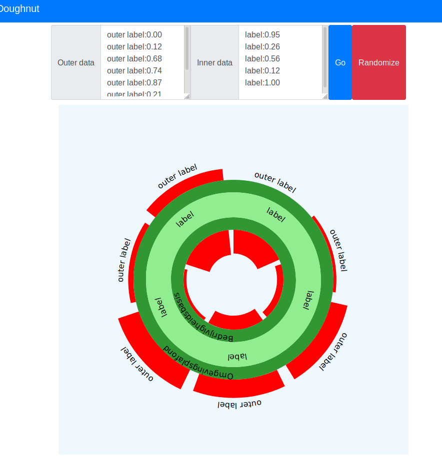

## Donut visualization

A demo for creating a d3 based donut visualization, based on https://www.kateraworth.com/doughnut/. See screenshot below. You can enter your own labels and values. 

### Usage

Clone the repository, navigate to the `public` directory and set up a http server, for example, with `python3`.

```python3 -m http.server```

Then you can view the demo on http://localhost:8000. It should look like below. Note that if you directly open `public/index.html`, you see something similar but it doesn't work; the numbers don't show up. 



